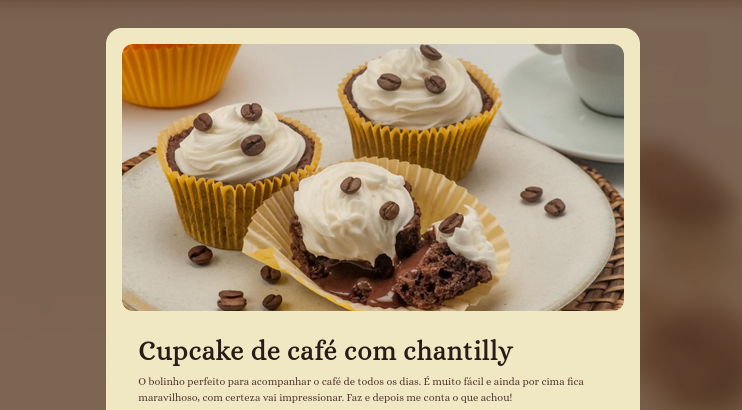

# Página de Receitas

## Sobre esse projeto
Nesse projeto, primaeira página desenvolvida na formação Full-Stack da [RocketSeat](https://app.rocketseat.com.br/), foram utilizados conhecimentos básicos adquiridos até aqui para construir uma página de receitas estática.

## Tecnologias utilizadas
- HTML 5
- CSS3
- Figma
- Git

Foram utilizados conceitos como:
- Estruturação semântica da página
- Seletores e combinadores
- Manipulação de imagens
- Configuração de fontes
- Definição de espaçamentos e cores 
- Estruturação a partir de layout Figma
- Versionamento com Git

## Visite a página!
Acesse a página para conferir o visual completo do projeto clicando [aqui!](https://marciolyp.github.io/paginaDeReceitas/)